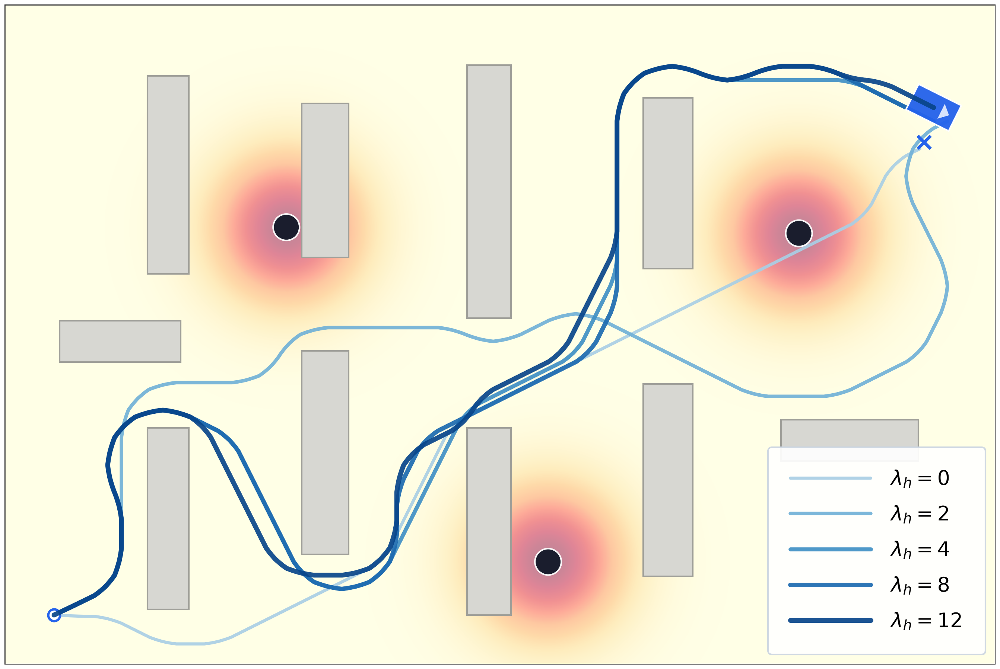

# Dynamic Obstacle-Aware Planning for Nonholonomic Multi-Robot Systems

**Author:** Manyoung Han  
**Class:** Motion planning and decision making for autonomous system (H.J.Kim.)

This repository contains a dynamic-obstacle-aware multi-robot warehouse planning
project. The system plans smooth nonholonomic trajectories for multiple robots
while avoiding shelves, walls, other robots, and moving pedestrians.

## Demo Video and Figures

### Demo Video

[Watch the warehouse planning demo](results/demo_video.mp4)

### Risk Heatmap with Human-Aware Path Ablation



This figure shows how the blue robot path changes as the human-risk weight
increases. The heatmap represents pedestrian risk around static human positions,
and darker blue paths correspond to stronger human-aware planning.

### Time-Gradient Trajectory Overview


This figure visualizes four robot trajectories and three pedestrian trajectories.
Each path becomes darker over time, showing the motion progression from start to
finish.

### Algorithm Comparison


The comparison summarizes distance, makespan, computation time, robot collision
counts, and human near-miss counts across baseline planners and the proposed
method.

## Project Overview

The goal of this project is to study practical motion planning for warehouse
robot fleets operating near dynamic pedestrians. In a warehouse environment,
robots should not only find short paths, but also:

- avoid static obstacles such as shelves and walls,
- avoid collisions with other robots in space-time,
- maintain safe clearance from pedestrians,
- move smoothly with nonholonomic, car-like motion,
- coordinate multiple robots so that they move concurrently when possible.

The final scenario uses:

- 4 robots,
- 3 pedestrians,
- static shelf-like warehouse obstacles,
- nonholonomic kinodynamic lattice planning,
- time-expanded robot reservations,
- dynamic pedestrian risk fields,
- bounded windowed conflict replanning.

Current paper-style results are saved under:

```text
results/0615_results/
```

## Algorithm / Method Summary

The implemented planner is a practical hybrid method rather than a full optimal
joint kinodynamic optimizer. It combines single-robot kinodynamic planning with
multi-robot conflict repair and pedestrian-aware risk costs.

### 1. Nonholonomic Kinodynamic Lattice Planning

Each robot is planned in a hybrid state space containing position, heading bin,
and time index. The planner expands motion primitives such as forward, left,
right, and wait. This produces paths that respect finite turning behavior instead
of purely holonomic grid motion.

### 2. Pedestrian Risk Field

Pedestrians are modeled as dynamic circular obstacles. Their short-horizon
positions are converted into Gaussian risk fields. Robot paths receive higher
cost when they pass close to predicted pedestrian locations, so the planner
prefers routes with larger human clearance.

### 3. Time-Expanded Robot Reservations

Previously planned robot trajectories reserve occupied cells over time. Later
robots avoid these reserved space-time cells, which reduces robot-robot and
edge-swap conflicts.

### 4. Bounded Windowed Conflict Replanning

After an initial prioritized solution is generated, the planner scans a finite
future window for robot-robot conflicts. When a conflict is found, only the
affected lower-priority robot suffix is replanned while the other robot paths are
kept as reservations. This improves coordination without the cost of full CBS or
full joint-state optimization.

### 5. Smooth Visualization

The planned lattice paths are rounded with Chaikin-style smoothing and dense
time interpolation for presentation-quality videos and figures. Quantitative
metrics are computed from the timed planner paths, while smoothing is used for
visualization.

## Installation

The project is written in Python and can be installed with a local virtual
environment.

```powershell
python -m venv .venv
.\.venv\Scripts\activate
pip install -r requirements.txt
```

If the virtual environment is already created, activate it with:

```powershell
.\.venv\Scripts\activate
```

## How to Run

### Run the Main Paper Experiment Suite

```powershell
python scripts/run_0615_experiments.py
```

This generates the main experiment outputs in:

```text
results/0615_results/
```

Main outputs include:

- `algorithm_comparison.csv`
- `algorithm_comparison.png`
- `algorithm_comparison_table.png`
- `risk_ablation_metrics.csv`
- `risk_ablation_plot.png`
- `planning_window_ablation.csv`
- `planning_window_ablation.png`
- `scenario_diversity_metrics.csv`
- `scenario_diversity_plot.png`
- `trajectory_gradient_overview.png`
- `risk_heatmap_blue_robot_static_pedestrians.png`

### Generate the Blue-Robot Risk Heatmap Figure

```powershell
python scripts/generate_blue_robot_static_risk_heatmap.py
```

Output:

```text
results/0615_results/risk_heatmap_blue_robot_static_pedestrians.png
results/0615_results/risk_heatmap_blue_robot_static_pedestrians.pdf
```

### Generate the Time-Gradient Trajectory Figure

```powershell
python scripts/generate_trajectory_gradient_image.py
```

Output:

```text
results/0615_results/trajectory_gradient_overview.png
results/0615_results/trajectory_gradient_overview.pdf
```

### Run the Clean Demo

```powershell
python main.py --clean-demo --no-show
```

This creates the presentation-style warehouse demo video in:

```text
results/multi_robot_demo.mp4
```

### Generate Paper-Style Figures and Video

```powershell
python scripts/generate_paper_figures.py
```

Output directory:

```text
results/paper_figures/
```

### Run the Final Evaluation Script

```powershell
python scripts/run_final_evaluation.py
```

Output directory:

```text
results/final_evaluation/
```

### Run Tests

```powershell
python -m pytest
```

or, using the local virtual environment directly:

```powershell
.\.venv\Scripts\python.exe -m pytest
```

## Repository Structure

```text
configs/
  warehouse_clean_demo.yaml

src/warehouse_planning/
  config.py
  maps/warehouse_map.py
  models/robot.py
  models/dynamic_obstacle.py
  planning/collision.py
  planning/kinodynamic_astar.py
  planning/prioritized.py
  planning/windowed.py
  simulation/simulator.py
  visualization/plotting.py
  visualization/smoothing.py
  visualization/clean_demo.py
  evaluation/metrics.py
  evaluation/benchmark.py

scripts/
  run_0615_experiments.py
  generate_blue_robot_static_risk_heatmap.py
  generate_trajectory_gradient_image.py
  generate_paper_figures.py
  run_final_evaluation.py
  run_cvpr_experiments.py

tests/
  test_*.py

results/
  demo_video.mp4
  multi_robot_demo.mp4
  0615_results/
```

## Notes

The proposed method is designed as a practical research prototype. It is not a
full optimal CBS/ECBS solver and does not solve full joint kinodynamic
optimization. Instead, it uses a scalable approximation that combines
nonholonomic single-robot search, human-risk-aware costs, time-expanded
reservations, and bounded conflict-window repair.
